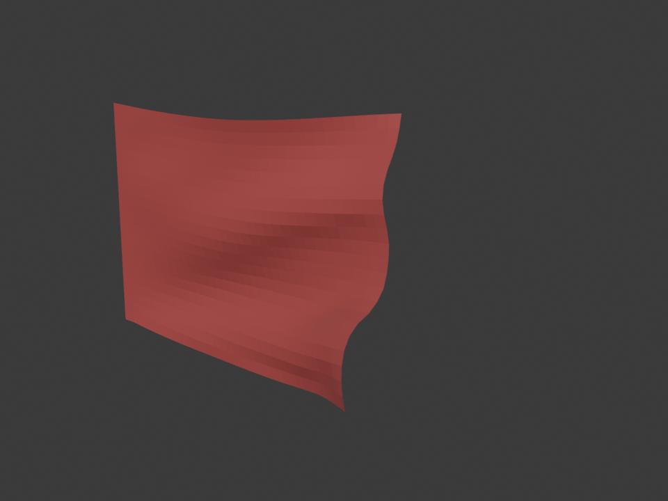
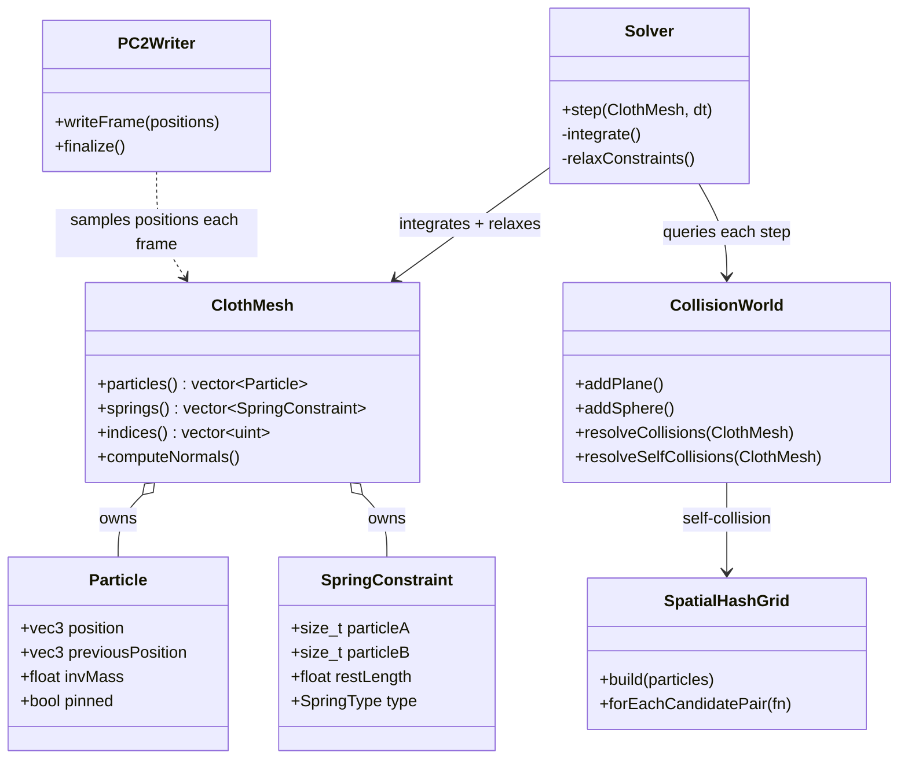

# cloth-sim


A C++17 cloth physics engine — Verlet integration, iterative constraint
relaxation, static and self-collision via a spatial hash grid — that exports
a binary PC2 point cache, importable natively into Blender's Mesh Cache
modifier for visualization. No custom Blender import code, no intermediate
formats: the same raw floats the solver produces are what Blender plays back.



## Problem statement

Simulating cloth well means balancing two things that are usually in
tension: the cloth has to *look* physically plausible (settles, drapes,
folds without interpenetrating) and the simulation has to be *stable*
regardless of how stiff or fine-grained you make it. This project builds
that from first principles — a particle/spring mesh, an integrator, and a
constraint solver — and separately verifies the result by getting it in
front of an industry-standard renderer (Blender) rather than trusting
console output alone.

## Why constraint relaxation instead of force-based springs

The first working version of the solver ([commit history, Step
3](../../commits/main)) used the textbook approach: model each spring with
Hooke's law (`F = -k * (distance - restLength)`) and integrate the
resulting acceleration with Verlet integration. It compiles, it runs, and
it is fundamentally unstable at any stiffness that actually looks like
cloth:

```
frame 10 | bbox max (2.56, 0.50, 7.58)          | max per-step displacement 8.08
frame 20 | bbox max (2.8e+11, 3.4e+10, 7.7e+11) | max per-step displacement 8.9e+11
frame 30 | bbox min (0,0,0) max (2,0,0)          | max per-step displacement 0   <- NaN poisoning comparisons
```

The problem isn't a bug, it's structural: real fabric barely stretches,
which means a physically accurate spring constant `k` is high. But
explicit force integration is only stable when the timestep satisfies
roughly `dt < 2/√(k/mass)` — the higher `k` goes to look convincing, the
smaller `dt` has to shrink to stay stable. At a normal 60fps timestep,
there's no `k` that is both "looks like cloth" and "numerically stable."
Each frame's spring correction overshoots the error instead of reducing
it, and the overshoot compounds geometrically until the simulation
diverges to `NaN` within about 30 frames.

The fix, added next, replaces spring **forces** with spring
**constraints**: after each integration step, directly move each spring's
two particles to sit exactly `restLength` apart (weighted by inverse mass,
repeated for a handful of iterations per frame — a technique often
attributed to Thomas Jakobsen). There is no acceleration to integrate and
therefore nothing to overshoot; the correction *is* the answer, not an
approximation of it. The same scenario that diverged in the force-based
version now settles cleanly:

```
frame  20 | max per-step displacement 0.0413649
frame 100 | max per-step displacement 0.00387086
frame 300 | max per-step displacement 0.00028
```

This is also why the solver can be arbitrarily stiff-looking without
tuning a timestep around it — stiffness is a constraint (`restLength`), not
a coefficient that interacts with `dt`.

## Why a spatial hash grid instead of brute-force self-collision

Checking whether a folded, crumpled piece of cloth intersects itself, the
naive approach is to test every particle against every other particle:
**O(n²)** distance checks per frame. For a modest 400-particle sheet
that's already 160,000 checks, 60 times a second, and it gets 4x worse
every time you double the mesh resolution.

`SpatialHashGrid` buckets particles into fixed-size 3D cells keyed by
integer coordinates (`floor(position / cellSize)`), an O(1) operation per
particle, so building the grid is **O(n)**. Because the cell size is
chosen to be at least as large as the minimum separation distance we care
about, any two particles actually close enough to matter are guaranteed to
land in the same cell or one of its 26 immediate neighbors — so finding
candidates near a given particle only ever means checking a fixed 27-cell
neighborhood, not the whole mesh. With particles spread roughly evenly
through space (true for cloth, even crumpled cloth), the total candidate
pairs found across the entire mesh comes out to **O(n)** instead of O(n²).

I verified this isn't just "the grid agrees with itself" by comparing its
candidate output against an independent O(n²) brute-force reference on a
random particle cloud (`tests/test_spatial_hash.cpp`) — the grid is
allowed to report some extra false-positive candidates (adjacent-cell
particles that aren't actually close enough), but it must never miss a
true neighbor pair, and the test asserts exactly that.

## Architecture



`ClothMesh` owns topology and state only — no physics. `Solver` is the only
class that mutates particle positions, in a fixed order each step:
integrate (gravity + wind) → relax spring constraints → self-collision →
static-collider resolution. `PC2Writer` and `CollisionWorld` never touch
each other; they only ever touch `ClothMesh`'s particle data.

## Tech stack

- **C++17**, CMake 3.16+ (`FetchContent` for dependencies, no manual installs)
- **[GLM](https://github.com/g-truc/glm)** — header-only vector math (`vec3`, `length`, `cross`)
- **[Catch2](https://github.com/catchorg/Catch2)** v3 — unit/regression tests, discovered by `ctest`
- **PC2** binary point-cache format — read natively by Blender's Mesh Cache modifier
- GitHub Actions CI (Ubuntu + Windows matrix)

## Build & run

```bash
cmake -B build
cmake --build build
```

Run the test suite:

```bash
cd build
ctest --output-on-failure
```

Run the simulator against a sample scene:

```bash
./build/clothsim --scene scenes/flag.txt
```

Or configure everything from the command line (see `--help` for the full
list — grid size, solver tuning, wind, colliders, self-collision, frame
count, output path):

```bash
./build/clothsim --resx 30 --resy 30 --pin-mode top_row --frames 200 --output curtain.pc2
```

Any flag passed after `--scene <path>` overrides that one setting from the
loaded scene file, so you can tweak a single value without editing the
file.

## Scene config format

Scene files (`scenes/*.txt`) are plain whitespace-separated `key value...`
text — one setting per line, `#` starts a comment. See
[`scenes/flag.txt`](scenes/flag.txt), [`scenes/curtain.txt`](scenes/curtain.txt),
and [`scenes/tablecloth_sphere.txt`](scenes/tablecloth_sphere.txt) for full
examples. Supported keys:

| Key | Meaning |
|---|---|
| `width`, `height` | cloth size in world units |
| `resx`, `resy` | particles across / down |
| `iterations` | constraint relaxation passes per step |
| `damping` | velocity retained per step (0-1) |
| `gravity` | gravity magnitude along -Y |
| `wind X Y Z` | constant additional acceleration |
| `self_collision F` | minimum particle separation; 0 disables |
| `pin_mode` | `none` \| `top_row` \| `left_column` |
| `center` | `true`/`false` — recenter the grid in X/Z before pinning |
| `offset X Y Z` | translate the grid before pinning |
| `sphere CX CY CZ R` | add a sphere collider |
| `plane PX PY PZ NX NY NZ` | add a plane collider (point + normal) |
| `frames`, `fps` | simulation length and rate |
| `output` | `.pc2` output path |

To add a new scene, copy one of the existing files and change what you
need — every key has a sensible default if omitted, so a minimal scene
file only needs to specify what makes it different (e.g. just `pin_mode`
and `wind` for a new flag variant).

## Importing into Blender

1. Run the CLI against a scene to produce a `.pc2` file (see above).
2. Open `blender/import_cloth.py` in Blender's **Scripting** tab.
3. Edit the constants at the top of the file (`RES_X`, `RES_Y`, `WIDTH`,
   `HEIGHT`, `FRAME_COUNT`, `PC2_PATH`) to match the scene you simulated —
   these must match exactly, since the script builds a mesh with the same
   vertex count and ordering as the C++ `ClothMesh`.
4. Run the script. It creates a mesh object with a Mesh Cache modifier
   already pointed at your `.pc2` file and sets the scene's playback range
   to match, so pressing play immediately shows the simulation.

I verified this end-to-end, not just "the script runs without errors":
using Blender in background mode, I compared Blender's actual evaluated
mesh (after the Mesh Cache modifier) against the raw bytes in the `.pc2`
file, vertex-by-vertex, at several points across playback for all three
sample scenes. Every comparison came back an exact `0.0` difference. One
non-obvious thing that surfaced during that process: the modifier's
`forward_axis`/`up_axis` settings aren't just labels, they actively remap
the cache's raw coordinates — the correct combination for this project's
data (which stores gravity along **-Y**, not Blender's own -Z-down
convention) is `forward_axis='POS_Y'`, `up_axis='POS_Z'`, found by testing
all 24 valid axis-pair combinations against that same byte-exact check
rather than by guessing.

## Complexity notes

- **Constraint relaxation**: O(springs × iterations) per frame — linear in
  mesh size for a fixed iteration count.
- **Static collision**: O(particles × colliders) per frame.
- **Self-collision**: O(n) amortized via the spatial hash grid (see above),
  vs. O(n²) for brute-force all-pairs checking.
- **PC2 export**: streamed frame-by-frame (`PC2Writer::writeFrame`), so
  memory use doesn't grow with simulation length — only the current
  frame's positions are ever buffered.

## Stretch goals

- **Alembic (`.abc`) export** as an alternative to PC2 — a more modern,
  widely-supported cache format (used across Maya/Houdini/Blender/USD
  pipelines) that also carries topology and UVs, not just raw vertex
  positions. PC2 was the right choice here for its simplicity and zero
  dependencies; Alembic would require linking against the Alembic/HDF5 or
  Ogawa libraries.
- Wind as a time-varying field (currently a constant acceleration) for more
  natural-looking flag flutter.
- GPU compute (e.g. a compute shader) for the constraint relaxation pass,
  which is the dominant cost at high resolutions.

## License

MIT — see [LICENSE](LICENSE).
